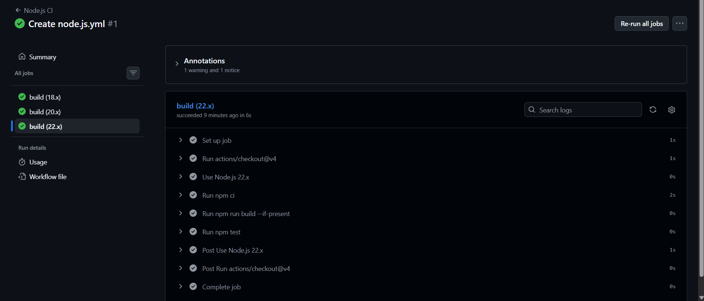
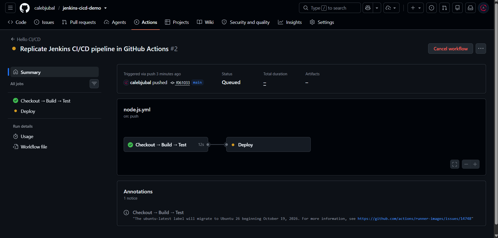
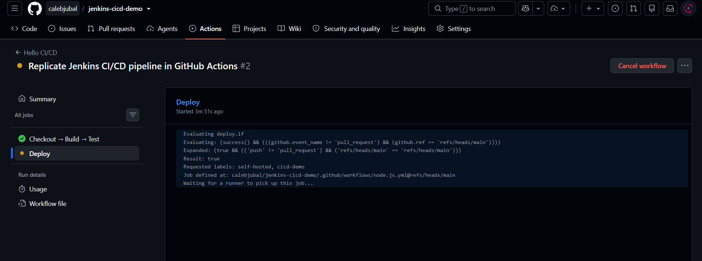

# CI/CD Workflow Report

## 1. Aim
Automate checkout, build, test, and deployment of a Node.js/Express application. The repository contains a Jenkins Pipeline and its GitHub Actions equivalent. Supplied screenshots document GitHub Actions execution.

## 2. Software Requirements
Git, GitHub, Node.js/npm, and Docker with Linux containers. Jenkins execution additionally requires Jenkins with Pipeline/Git plugins. The current GitHub Actions workflow selects Node.js 24, a GitHub-hosted `ubuntu-latest` build/test runner, and a persistent self-hosted deployment runner labeled `cicd-demo`.

The older CI screenshot shows Node.js 18.x, 20.x, and 22.x jobs. It records the earlier workflow rather than the current Node.js 24 configuration. Exact Docker and Jenkins versions are not shown.

## 3. CI/CD Architecture
```text
Developer → git push → GitHub repository
  ├─ GitHub Actions → Checkout → Build → Test (GitHub-hosted runner)
  │                    → Deploy (self-hosted runner) → Docker app:3000
  └─ Jenkins SCM polling → Checkout → Build → Test → Deploy → Docker app:3000
```

GitHub Actions is the execution path shown in the supplied evidence. Jenkins and Actions reuse the same npm commands. Enable only one deployment system for the shared host/container.

## 4. GitHub Repository Setup
Repository: [calebjubal/jenkins-cicd-demo](https://github.com/calebjubal/jenkins-cicd-demo), branch `main`. Initial commit: `ef70917`. Run #2 identifies pushed commit `f061033` and the title “Replicate Jenkins CI/CD pipeline in GitHub Actions”.

## 5. Pipeline Configuration
[Jenkinsfile](../Jenkinsfile) defines the Jenkins Pipeline from SCM, with explicit checkout and polling. No Jenkins configuration or execution screenshot was supplied.

[GitHub Actions workflow](../.github/workflows/node.js.yml) runs on pushes and pull requests to `main`, plus manual dispatch. Build/test runs before Deploy through `needs: build-test`. Deployment is restricted to non-pull-request runs on `main`. Each job has a 15-minute execution timeout, and deployment concurrency is limited to one active job.

## 6. Pipeline as Code
The [Jenkinsfile at commit e67f180](https://github.com/calebjubal/jenkins-cicd-demo/blob/e67f180/Jenkinsfile) defines Checkout, Build, Test, Deploy, and success/failure post conditions. The [Actions workflow at evidenced commit f061033](https://github.com/calebjubal/jenkins-cicd-demo/blob/f061033/.github/workflows/node.js.yml) implements the equivalent commands in two dependent jobs.

## 7. Build Stage
`npm ci` installs dependencies from `package-lock.json`; `npm run build` checks JavaScript syntax. Express requires no compilation. `ci.png` shows completed installation and build steps in the original workflow. `workflow.png` shows the updated combined Checkout → Build → Test job succeeded in 12 seconds.

## 8. Test Stage
`npm test` runs HTTP tests for the greeting, health endpoint, and unknown-route 404. The screenshots show successful test/job status; the individual test counts and assertions are not expanded in the captured logs. Local verification performed during project setup passed all three tests.

## 9. Deployment Stage
`npm run deploy` builds a Docker image, replaces the named `jenkins-cicd-demo` container, and polls `/health`. The intended URL is `http://localhost:3000` on the deployment host.

In `deploy.png`, the deployment condition evaluates to true for a push on `main`. The job requests `self-hosted, cicd-demo` and reports “Waiting for a runner to pick up this job...”. This confirms a queued deployment at capture time. No image-build output, health-check success, or running application screenshot is present; successful deployment is not yet evidenced.

## 10. Build Trigger Configuration
`workflow.png` explicitly shows run #2 was triggered via push on `main`, for commit `f061033`. This demonstrates automatic workflow triggering after a repository change. Jenkins is configured separately with `pollSCM('H/2 * * * *')`; its trigger has not been evidenced by these screenshots.

## 11. Post-Build Actions
Jenkins uses `post { success ... failure ... }`. Actions uses steps conditioned on `success()` and `failure()`. The deployment success message cannot have been evidenced in the queued deployment screenshot.

## 12. Execution Results
| Run | Workflow / revision | Trigger | Observed result | Timing shown |
| --- | --- | --- | --- | --- |
| #1 | Node.js CI; “Create node.js.yml” (history commit `4afc3fc`) | Not visible in supplied capture | Node 18.x, 20.x, 22.x jobs successful | Selected 22.x job: 6 seconds |
| #2 | Hello CI/CD; `f061033` on `main` | Push | Checkout → Build → Test successful; Deploy queued | Build/test: 12 seconds |

Run #1's commit is associated through local Git history; its SHA is not visible in `ci.png`. Run #2's SHA and push trigger are visible in `workflow.png`. Exact timestamps and final deployment outcome are not available in the captures.

## 13. Screenshots

### Figure 1 — Initial CI execution
The original Node.js CI workflow completed all three matrix jobs. The selected Node.js 22.x job shows successful checkout, dependency installation, build, and test steps. One warning and one notice are listed without expanded details.



### Figure 2 — Updated workflow and automatic push trigger
Hello CI/CD run #2, triggered by push of `f061033` to `main`, shows the successful 12-second Checkout → Build → Test job connected to a queued Deploy job. A runner-image migration notice is visible; no CI failure is shown.



### Figure 3 — Deployment runner requirement
The deployment condition evaluates to true. Requested labels are `self-hosted, cicd-demo`; the job is waiting for an eligible runner.



## 14. Git Commit History
History recorded before this documentation update:

```text
f061033 Replicate Jenkins CI/CD pipeline in GitHub Actions
4afc3fc Create node.js.yml
53a2e93 Document Jenkins setup and CI/CD submission evidence
e67f180 Add Jenkins build test and deploy pipeline
a9dd571 Add Express demo with HTTP tests and Docker deployment
ef70917 Initial commit
```

The screenshot for run #2 links execution to `f061033`. Repository [commit history](https://github.com/calebjubal/jenkins-cicd-demo/commits/main/) provides the accompanying change record.

## 15. Observations
- Repository changes automatically triggered the updated Actions workflow.
- Both the original CI matrix and the updated combined CI job succeeded in the supplied captures.
- Deployment was awaiting a matching self-hosted runner. The images do not establish whether one was absent, offline, or busy.
- To finish the demonstration, bring one runner with the `cicd-demo` label online, ensure local Docker access and port 3000 availability, then capture deployment logs, the final result, and the application in a browser.
- Deployment replaces one container, causes brief downtime, and has no automatic rollback. Persistence after job completion remains to be demonstrated.

## 16. Conclusion
The supplied evidence demonstrates automated GitHub Actions checkout, build, and test, plus a correctly gated deployment job queued for a self-hosted runner. The repository also provides the equivalent Jenkins Pipeline. End-to-end deployment and Jenkins execution require additional evidence before claiming full completion.

## References
[Jenkins Pipeline](https://www.jenkins.io/doc/book/pipeline/), [Pipeline Syntax](https://www.jenkins.io/doc/book/pipeline/syntax/), and [Pipeline as Code](https://www.jenkins.io/doc/book/pipeline/pipeline-as-code/). Repository implementation and the three supplied screenshots are the sources for the recorded results.
